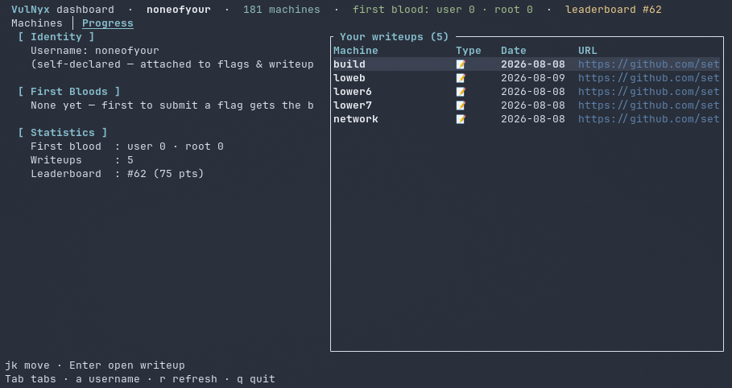

# nyx-tui

### Dashboard de terminal no oficial para VulNyx

<p align="center">
  
</p>

**[English](README.md) | [Español](README.es.md)**

---

**nyx-tui** es un dashboard interactivo de terminal para [VulNyx](https://vulnyx.com): explora el catálogo de máquinas, envía flags first-blood, lee y publica writeups de la comunidad y sigue tu posición en el leaderboard — todo sin salir de la terminal. La descarga de máquinas abre la página de descarga de VulnyX en tu navegador, donde completas el CAPTCHA y descargas la máquina tú mismo.

Un comando, una pantalla: al ejecutar `nyx` se abre el dashboard. Escrito en **Rust** puro (ratatui), distribuido como un único binario estático. Interfaz en inglés, tema Nord. **No se necesita cuenta** — solo un nombre de usuario.

---

## Capturas de pantalla

| Machines | Progress |
| :---: | :---: |
|  |  |

## Características

* **Un comando** — `nyx` abre el dashboard: catálogo, flags first-blood, writeups y tu posición en el leaderboard en una sola pantalla.
* **Machines** — el catálogo completo con los colores oficiales de dificultad del sitio (Low/Easy/Medium/Hard), SO (Linux/Windows), etiquetas de tecnologías y estado de first-blood por máquina. Filtrado instantáneo con `/` y ordenamiento con `s` (orden del sitio → nombre → fecha → dificultad).
* **Envío de flags first-blood** — `f` abre una ventana para enviar las flags User y Root (MD5). Los huecos ya ocupados se muestran como avisos de solo lectura; los huecos libres quedan listos para tu hash MD5. Tu nombre de usuario se adjunta automáticamente.
* **Filtro first-blood** — `b` muestra solo las máquinas con algún hueco de first-blood libre, para que seas el primero en completear un lanzamiento nuevo.
* **Writeups** — ventana de writeups de la comunidad por máquina (`w`): artículos 📝 y vídeos 🎥 con autor, idioma y fecha. Publica el tuyo (`u`).
* **Progress** — tus first bloods, writeups y posición en el leaderboard (calculada a partir de los datos públicos con las reglas de puntuación del propio sitio).
* **Gestión del nombre de usuario** — `a` abre la ventana de usuario; el nombre que pongas se adjunta a todos los envíos y se usa para calcular tu posición en el leaderboard.

---

## Requisitos

* **SO**: Linux (desarrollado y probado en Arch Linux); se publican binarios para macOS y Windows.
* **No** se necesita cuenta de [VulNyx](https://vulnyx.com) — la plataforma funciona con un nombre de usuario declarado por ti.

---

## Instalación

### 1. Desde un binario de release (lo más fácil)

Descarga el archivo de tu plataforma desde la página de [Releases](https://github.com/setyanoegraha/nyx-tui/releases):

| Plataforma | Archivo |
| :--- | :--- |
| Linux x86_64 | `nyx-v0.1.3-x86_64-unknown-linux-gnu.tar.gz` |
| macOS Apple Silicon | `nyx-v0.1.3-aarch64-apple-darwin.tar.gz` |
| macOS Intel | `nyx-v0.1.3-x86_64-apple-darwin.tar.gz` |
| Windows x86_64 | `nyx-v0.1.3-x86_64-pc-windows-msvc.zip` |

```bash
tar xzf nyx-v0.1.3-x86_64-unknown-linux-gnu.tar.gz
install -m 755 nyx ~/.local/bin/nyx
```

### 2. Desde el código fuente

```bash
git clone https://github.com/setyanoegraha/nyx-tui.git
cd nyx-tui
cargo install --path .
```

### 3. Directamente desde git

```bash
cargo install --git https://github.com/setyanoegraha/nyx-tui.git
```

> Requiere la toolchain de Rust (1.85+): https://rustup.rs

---

## Primer arranque

Simplemente ejecuta:

```bash
nyx
```

El dashboard carga de inmediato — sin ventana de login. Pulsa `a` para poner tu **nombre de usuario** (p. ej. `noneofyour`). Ese nombre se adjunta a todos los envíos de flags y writeups y se usa para calcular tu posición en el leaderboard. Puedes cambiarlo en cualquier momento.

---

## Guía de uso

Dos pestañas manejadas por teclado — **Machines** y **Progress**:

| Teclas | Acción |
| :--- | :--- |
| `Tab` / `←` `→` | Cambiar de pestaña |
| `↑` `↓` / `j` `k` | Mover la selección |
| `g` / `Home` | Ir al principio de la lista |
| `/` | Filtrar la lista actual (escribe para acotar, `Enter` confirma, `Esc` limpia y sale) |
| `s` | **Machines** — ciclar orden: orden del sitio → nombre → fecha → dificultad |
| `b` | **Machines** — mostrar solo máquinas con hueco de first-blood libre |
| `d` | **Machines** — abrir la página de descarga de la máquina en tu navegador (CAPTCHA + descarga ocurren ahí) |
| `f` | **Machines** — ventana de flags first-blood: enviar flags User y/o Root (MD5). Los huecos ocupados se muestran como avisos de solo lectura |
| `w` | **Machines** — ventana de writeups de la comunidad de la máquina seleccionada: `j`/`k` para elegir, `Enter` abre el enlace |
| `u` | **Machines** — enviar una URL de writeup para la máquina seleccionada (pendiente de revisión de un admin) |
| `i` / `Enter` | **Machines** — ventana de descripción con etiquetas, plataformas, MD5 y poseedores del first-blood |
| `a` | **En cualquier pestaña** — ventana de nombre de usuario |
| `Enter` | **Progress** — abrir el writeup seleccionado en tu navegador |
| `r` | Volver a obtener todos los datos |
| `q` / `Esc` / `Ctrl-C` | Salir |

### Descargas

VulnyX protege la descarga de máquinas con una imagen CAPTCHA (5 caracteres, A-Z 0-9) en el navegador. nyx-tui deja el flujo donde ya funciona bien:

1. Pulsa `d` sobre una máquina — su página de descarga (`https://vulnyx.com/download.php?vm=<nombre>`) se abre en tu navegador.
2. Completa el CAPTCHA y descarga el `.ova` ahí.

nyx-tui no se mete en camino: sin descarga integrada, sin visor de imágenes, sin escribir códigos a mano.

### Dónde viven tus datos
- `~/.nyx-tui/config.json` — tu **nombre de usuario**. Nada más.
- No se guarda ninguna contraseña — VulNyx no tiene cuentas y el nombre de usuario lo declara cada uno.

---

## Actualizar

```bash
cargo install --git https://github.com/setyanoegraha/nyx-tui.git --force
```

o descarga el último binario de la página de [Releases](https://github.com/setyanoegraha/nyx-tui/releases).

### Desinstalación y limpieza

```bash
cargo uninstall nyx
```

Borra `~/.nyx-tui/` para eliminar todos los datos locales.

---

## Aviso

nyx-tui es una herramienta comunitaria **no oficial** y no está afiliada a VulNyx. Solo usa los datos JSON públicos de la plataforma y abre en tu navegador las mismas páginas de descarga que usa la aplicación web — sé amable con el servicio.

---

## Agradecimientos

Gracias al equipo y la comunidad de VulNyx por la plataforma, y al equipo de [ratatui](https://github.com/ratatui/ratatui) por el toolkit.

Proyectos hermanos:
- [hmv-tui](https://github.com/setyanoegraha/hmv-tui) — el mismo concepto de dashboard para HackMyVM
- [dl-tui](https://github.com/setyanoegraha/dl-tui) — el mismo concepto de dashboard para DockerLabs

---

Hecho con ❤️ por [Ouba](https://github.com/setyanoegraha).

*¡Happy hacking en VulNyx!*
