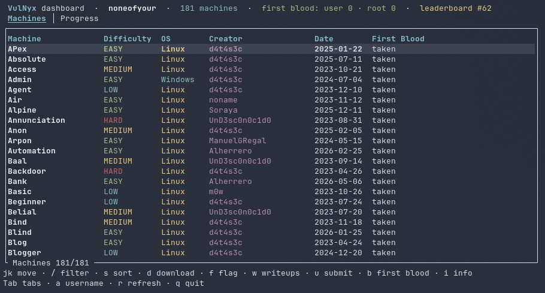

# nyx-tui

### Unofficial VulnyX terminal dashboard — TUI tidak resmi untuk VulnyX

<p align="center">
  
</p>

**nyx-tui** is an interactive terminal dashboard for [VulnyX](https://vulnyx.com): browse the machine catalog, download machines (with built-in CAPTCHA assist), submit first-blood flags, read and submit community writeups, and track your leaderboard position — all without leaving the terminal.

One command, one screen: running `nyx` opens the dashboard. Written in pure **Rust** (ratatui), shipped as a single static binary. UI in English, Nord theme. **No account needed** — just a username.

---

## Screenshots

| Machines | Progress |
| :---: | :---: |
|  |  |

## Features

* **One command** — `nyx` opens the dashboard: catalog, downloads, writeups, first-blood flags and your leaderboard position in one screen.
* **Machines** — the full catalog with the site's official difficulty colors (Low/Easy/Medium/Hard), OS (Linux/Windows), tech tags, and first-blood status per machine. Instant `/` filtering and `s` sorting (site order → name → date → difficulty).
* **First-blood flag submission** — `f` opens a popup to submit User and Root flags (MD5). Slots already taken are shown as read-only notices; open slots are ready for your MD5 hash. Your username is attached automatically.
* **First-blood filter** — `b` shows only machines with an open first-blood slot, so you can be the first to pwn a fresh release.
* **Downloads** — machines stream directly from VulnyX's storage: up to **2 in parallel** (the platform's own cap), live gauges in the Downloads overlay, MD5-verified against the catalog. The platform's CAPTCHA gate is handled in-app: the image opens in your viewer, you type the 5-character code, and the download proceeds.
* **Writeups** — per-machine community writeups popup (`w`): articles 📝 and videos 🎥 with author, language and date. Submit your own (`u`). A dedicated **Writeups** tab lists every writeup on the platform (1,200+).
* **Progress** — your first bloods, writeups, leaderboard position (computed from public data with the site's own scoring rules) and per-machine certificate/cert-id details.
* **Username management** — `a` opens the username popup; whatever you set is attached to all submissions and used for your leaderboard position.

---

## Prerequisites

* **OS**: Linux (developed and tested on Arch Linux); macOS and Windows release binaries are provided.
* A [VulnyX](https://vulnyx.com) account is **not** required — the platform works with a self-declared username.
* An image viewer (e.g. `feh`, `eog`) for the CAPTCHA download flow.

---

## Installation

### 1. From a release binary (easiest)

Grab the archive for your platform from the [Releases](https://github.com/setyanoegraha/nyx-tui/releases) page:

| Platform | Archive |
| :--- | :--- |
| Linux x86_64 | `nyx-v0.1.0-x86_64-unknown-linux-gnu.tar.gz` |
| macOS Apple Silicon | `nyx-v0.1.0-aarch64-apple-darwin.tar.gz` |
| macOS Intel | `nyx-v0.1.0-x86_64-apple-darwin.tar.gz` |
| Windows x86_64 | `nyx-v0.1.0-x86_64-pc-windows-msvc.zip` |

```bash
tar xzf nyx-v0.1.0-x86_64-unknown-linux-gnu.tar.gz
install -m 755 nyx ~/.local/bin/nyx
```

### 2. From source

```bash
git clone https://github.com/setyanoegraha/nyx-tui.git
cd nyx-tui
cargo install --path .
```

### 3. From git directly

```bash
cargo install --git https://github.com/setyanoegraha/nyx-tui.git
```

> Requires the Rust toolchain (1.85+): https://rustup.rs

---

## First Setup

Just run:

```bash
nyx
```

The dashboard loads immediately — no login popup. Press `a` to set your **username** (e.g. `noneofyour`). This username is attached to all flag and writeup submissions and used to compute your leaderboard position. You can change it at any time.

---

## Usage Guide

Three keyboard-driven tabs — **Machines**, **Progress** and **Writeups**:

| Keys | Action |
| :--- | :--- |
| `Tab` / `←` `→` | Switch tabs |
| `↑` `↓` / `j` `k` | Move selection |
| `g` / `Home` | Jump to the top of the list |
| `/` | Filter the current list (type to narrow, `Enter` keeps it, `Esc` clears & exits) |
| `s` | **Machines** — cycle sort: site order → name → date → difficulty |
| `b` | **Machines** — show only machines with an open first-blood slot |
| `d` | **Machines** — download popup: pick the destination folder (remembered across sessions), CAPTCHA image opens in your viewer, type the code, and the `.ova` streams with live progress |
| `f` | **Machines** — first-blood flag popup: submit User and/or Root flags (MD5). Slots already taken are shown as read-only notices |
| `w` | **Machines** — community writeups popup for the selected machine: `j`/`k` select, `Enter` opens the link |
| `u` | **Machines** — submit a writeup URL for the selected machine (pending admin review) |
| `i` / `Enter` | **Machines** — description popup with tags, platforms, MD5, first-blood holders |
| `a` | **Anywhere** — username popup |
| `o` | Toggle the Downloads overlay (live gauges, speed, destination paths) |
| `c` | In the Downloads overlay — cancel the most recent active download |
| `Enter` | **Progress/Writeups** — open the selected writeup in your browser |
| `r` | Re-fetch all data |
| `q` / `Esc` / `Ctrl-C` | Quit (with active downloads, the first `q` lists them — press again to abort) |

### Downloads & CAPTCHA

VulnyX gates machine downloads behind a CAPTCHA image (5 characters, A-Z 0-9) and caps downloads at 2 per minute. nyx-tui handles this transparently:

1. Press `d` on a machine and confirm the destination folder.
2. The CAPTCHA image opens in your image viewer.
3. A popup appears — type the 5-character code and press `Enter`.
4. The `.ova` streams to your destination, MD5-verified against the catalog.

The built-in solver attempts to read the CAPTCHA automatically (it uses a clean dotted pixel font) — if it succeeds, no manual input is needed. When the solver can't read it, the popup appears for manual entry.

### Where Your Data Lives

- `~/.nyx-tui/config.json` — your **username** and the **last download folder**. Nothing else.
- No password is stored — VulnyX has no accounts, and the username is self-declared.

---

## Updating

```bash
cargo install --git https://github.com/setyanoegraha/nyx-tui.git --force
```

or grab the latest release binary from the [Releases](https://github.com/setyanoegraha/nyx-tui/releases) page.

### Uninstallation & Cleanup

```bash
cargo uninstall nyx
```

Delete `~/.nyx-tui/` to clear all local data.

---

## Disclaimer

nyx-tui is an **unofficial** community tool and is not affiliated with VulnyX. It only uses the platform's public JSON data and the same download pages the web app uses, at human speed — be kind to the service.

---

## Acknowledgements

Thanks to the VulnyX team and community for the platform, and to the [ratatui](https://github.com/ratatui/ratatui) team for the toolkit.

Sibling projects:
- [hmv-tui](https://github.com/setyanoegraha/hmv-tui) — the same dashboard concept for HackMyVM
- [dl-tui](https://github.com/setyanoegraha/dl-tui) — the same dashboard concept for DockerLabs

---

Made with ❤️ by [Ouba](https://github.com/setyanoegraha).

*Happy hacking on VulnyX!*
